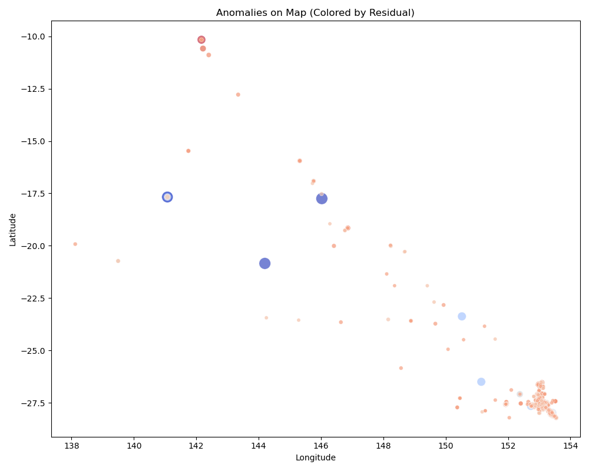
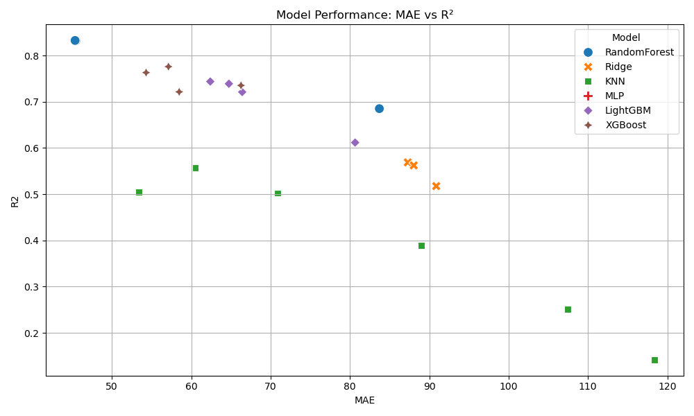
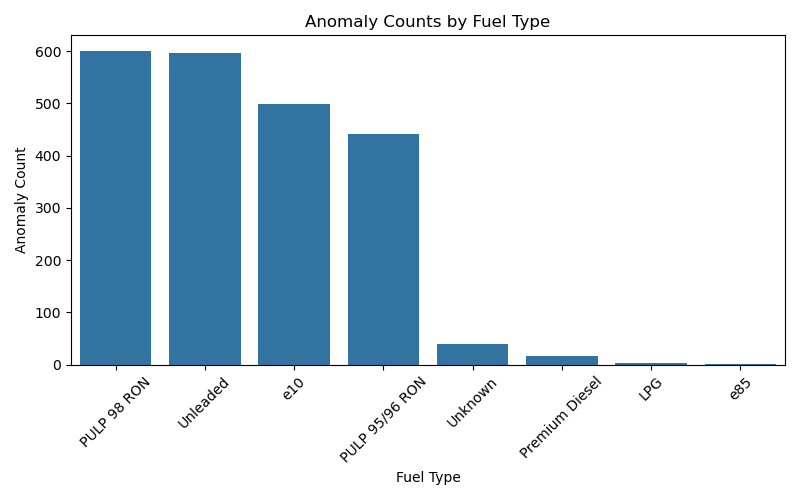

# QLD Fuel Price Anomaly Detection

## Overview

This project implements a machine learning pipeline for **detecting anomalous fuel prices** across Queensland, Australia. The approach combines data analysis, feature engineering, regression modeling, and contextual anomaly detection using model residuals. The repo demonstrates a practical data science workflow, from data cleaning to visualization and model benchmarking.

---

## Project Structure

QLD_Fuel_Anomaly_Detection/
├── data/
│ ├── sample_processed.csv # Small sample for demo/testing
│ ├── anomalies.csv # Flagged anomalies (results)
│ └── *.png # Generated visualizations
├── models/ # Trained models (not included in repo)
├── scripts/
│ ├── preprocessing/
│ ├── model_exploration/
│ ├── model_evaluation/
│ └── analysis/
├── notebooks/ # (Optional) EDA or demo notebooks
├── .gitignore
├── requirements.txt
└── README.md

---

## Getting Started

1. **Clone the repository**
    ```bash
    git clone https://github.com/Arni-tech/Fuel_Anomaly_Detection.git
    cd Fuel_Anomaly_Detection
    ```

2. **Install dependencies**
    ```bash
    pip install -r requirements.txt
    ```

3. **Prepare data**
    - Only `data/sample_processed.csv` is included for demonstration.
    - To run the full workflow, place the raw or processed dataset in `data/` (not included in the repo).

4. **Run scripts**
    - Scripts are organized by stage:
        - `scripts/preprocessing/` – data cleaning and preparation
        - `scripts/model_exploration/` – model training/benchmarking
        - `scripts/model_evaluation/` – analysis, anomaly detection, feature importance
        - `scripts/analysis/` – visualization of results

    - Example:
        ```bash
        python scripts/model_exploration/rf_exploration.py
        python scripts/model_evaluation/anomaly_detection.py
        python scripts/analysis/visualize_anomalies.py
        ```

---

## Key Results

- **Modeling:** Random Forest and boosted trees (LightGBM, XGBoost) performed best for fuel price prediction.
- **Anomalies:** About 1.8% of records were flagged as "contextual anomalies" (actual price highly different from model prediction).
- **Visualization:** Clear patterns in anomaly location, time, and fuel type.

---

## Example Visualizations

### Anomaly Map


### Model Performance Comparison


### Anomaly Counts by Fuel Type


---

## Notes

- **No datasets or trained models are included.** Only sample/demo data and selected results are provided.
- All scripts are self-contained for transparency and reproducibility.
- Project is intended as a demonstration of applied data science and ML for anomaly detection in real-world tabular data.

---


